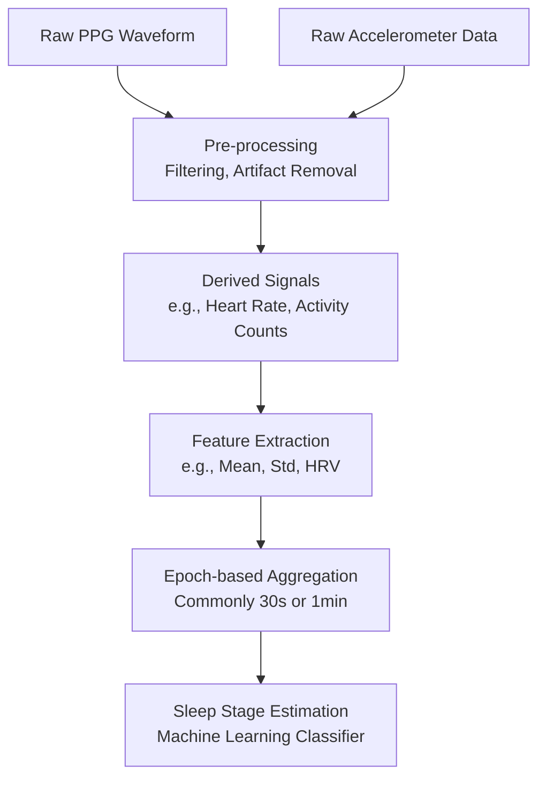
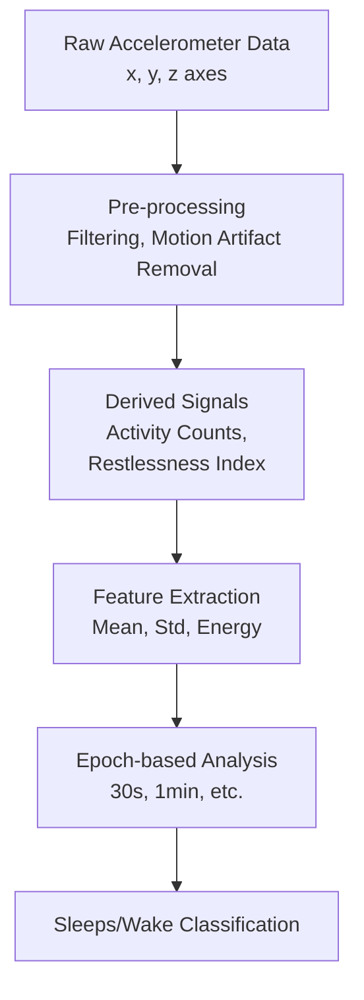

# How do raw signals get converted to features?

# Automated Sleep Tracking: From Raw Signals to Features

In automated sleep tracking systems, sensors such as **Photoplethysmography (PPG)** and **accelerometers** produce raw signals. These signals undergo several stages of transformation—**from raw data to processed signals, derived signals, and eventually features**—to facilitate sleep state estimation or classification. This document provides an overview of these stages and how **epochs** fit into the feature extraction process.

---

## Definitions

Below is a concise set of definitions for each step in the signal-to-feature processing chain:

1. **Raw Signal**
    
    - **Definition:** The unprocessed, continuous data directly output from the sensor (e.g., the voltage changes from a PPG, or x/y/z acceleration values from an accelerometer).
    - **Example:** Accelerometer output at 50 Hz producing readings in three axes (x, y, z).
2. **Processed Signal**
    
    - **Definition:** The raw signal after applying cleaning or filtering techniques to remove noise or artifacts (e.g., baseline wander, motion artifacts).
    - **Example:** Low-pass filtered acceleration data to remove high-frequency noise, or filtered PPG to remove baseline drift.
3. **Derived Signal**
    
    - **Definition:** A new signal or time series computed from the processed signal that captures a biologically or contextually meaningful quantity.
    - **Example:**
        - Heart rate extracted from the PPG waveform.
        - Activity count or restfulness index computed from the processed accelerometer data.
4. **Feature**
    
    - **Definition:** A numerical measure or statistic extracted from the raw, processed, or derived signals over a specified time window (epoch). These features are used for classification, regression, or other machine learning tasks.
    - **Example:**
        - Mean or standard deviation of acceleration data over an epoch.
        - Heart rate variability (HRV) metrics (e.g., RMSSD) computed from the derived heart rate signal.
5. **Epoch**
    
    - **Definition:** A fixed-length time segment (commonly 30 seconds or 1 minute in sleep studies) used to segment continuous data for analysis. Each epoch is processed to extract one or more feature values.
    - **Relationship to Feature Extraction:** Signals are often split into **epochs** and features are calculated within each epoch. This segmentation helps standardize how features are computed and aligned with sleep staging intervals.

---

## General Signal-to-Feature Pipeline

6. **Raw Signals:** PPG and accelerometer outputs.
7. **Pre-processing:** Steps include filtering, downsampling, artifact removal (motion artifacts, signal drift).
8. **Derived Signals:** Computed metrics, such as heart rate from PPG or activity counts from accelerometer.
9. **Feature Extraction:** Calculation of descriptive statistics or domain-specific metrics (mean, standard deviation, HRV parameters).
10. **Epoch-based Aggregation:** Splitting data into fixed-length segments (e.g., 30 seconds) and summarizing the features in each segment.
11. **Sleep Stage Estimation:** Use the feature set in each epoch to predict sleep stages or overall sleep/wake state.

---

## Focused Example: Accelerometer Data Pipeline

Below is a simplified diagram focusing on how accelerometer data moves through the processing chain:

### Step-by-Step

12. **Raw Accelerometer Data:** Direct readings (x, y, z) from the accelerometer at a given sampling rate (e.g., 50 Hz).
13. **Pre-processing:**
    - Filtering to remove high-frequency noise.
    - Artifact removal (e.g., removing or correcting spikes due to sensor errors).
14. **Derived Signals:**
    - **Activity Counts:** Convert continuous acceleration to a measure of movement over time.
    - **Restlessness Index:** Heuristic metric representing the degree of movement.
15. **Feature Extraction:**
    - **Mean Acceleration** within an epoch.
    - **Standard Deviation** of acceleration indicating variability.
    - **Energy** (sum of squared accelerations).
16. **Epoch-based Analysis:**
    - Each epoch (e.g., 30 seconds) is treated as a separate window for analysis.
    - Features (e.g., mean, std) are calculated within that epoch.
17. **Sleep/Wake Classification:**
    - Using the features computed for each epoch, a model classifies whether the user is asleep or awake (or assigns a sleep stage if the model is more advanced).

---

## How Epochs Help in Feature Extraction

- **Standardized Time Segments:** By using fixed intervals (epochs), we can compare signals and features consistently across a whole night of sleep data.
- **Temporal Alignment:** Sleep scorers or algorithms typically assign a stage to each 30-second or 1-minute segment, enabling a straightforward mapping of calculated features to labeled stages.
- **Statistical Summaries:** Many features (mean, variance, etc.) naturally require a defined time window, making the concept of an epoch key to the calculation process.

---

## Key Takeaways

18. **Raw vs. Processed Signals:**
    
    - Raw signals are the direct sensor outputs.
    - Processed signals are cleaned or filtered versions of these raw signals.
19. **Derived Signals:**
    
    - Provide more direct insight into physiological or behavioral states (heart rate, movement counts).
20. **Features:**
    
    - Numerical summaries (e.g., mean, standard deviation, HRV metrics) that serve as the input to classification or further statistical analysis.
21. **Epochs:**
    
    - Time windows (30 seconds, 1 minute) used to break up the continuous signal.
    - Provide a uniform context for feature calculation and subsequent classification or scoring.

This hierarchy—**Raw Data → Processed Data → Derived Signals → Features → (Epoch-based) Sleep Analysis**—forms the backbone of automated sleep tracking algorithms. By carefully defining and calculating features over epochs, it becomes feasible to implement machine learning or rule-based models that estimate different sleep stages or overall sleep quality.