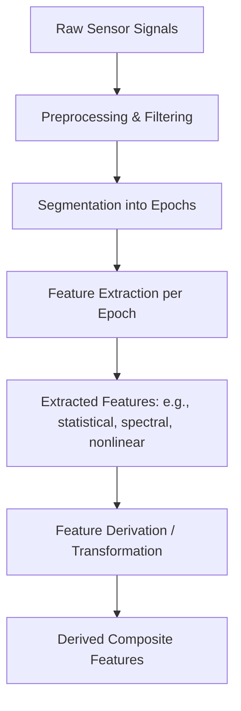
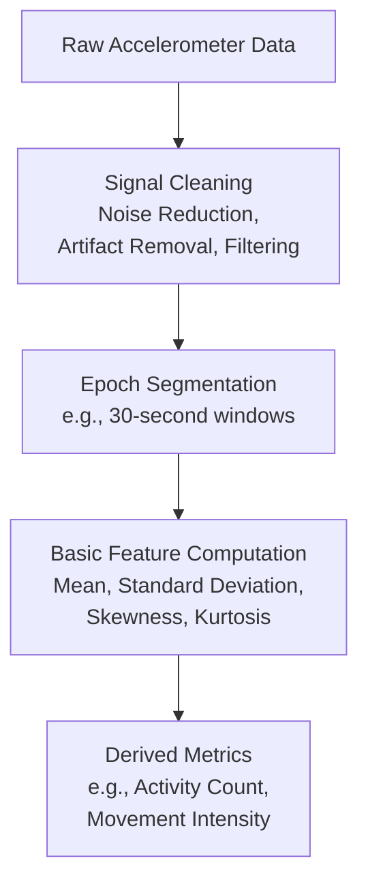

```mermaid
flowchart TD
    A[Raw Sensor Signals]
    B[Preprocessing & Filtering]
    C[Segmentation into Epochs]
    D[Feature Extraction per Epoch]
    E[Extracted Features: e.g., statistical, spectral, nonlinear]
    F[Feature Derivation / Transformation]
    G[Derived Composite Features]

    A --> B
    B --> C
    C --> D
    D --> E
    E --> F
    F --> G

```

```mermaid
flowchart TD
    A1[Raw Accelerometer Data]
    B1[Signal Cleaning<br/>Noise Reduction,<br/>Artifact Removal, Filtering]
    C1[Epoch Segmentation<br/>e.g., 30-second windows]
    D1[Basic Feature Computation<br/>Mean, Standard Deviation,<br/>Skewness, Kurtosis]
    E1[Derived Metrics<br/>e.g., Activity Count,<br/>Movement Intensity]
    
    A1 --> B1
    B1 --> C1
    C1 --> D1
    D1 --> E1

```
