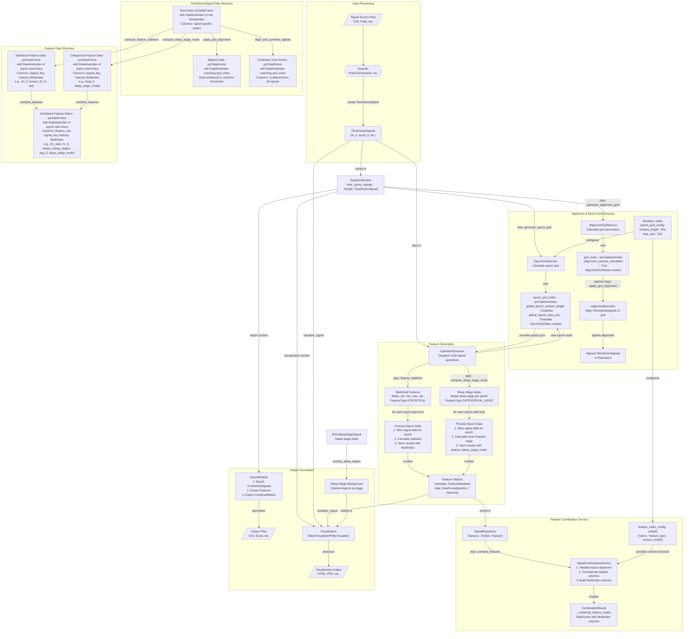

# Adaptive Sleep Algorithms - System Diagrams

This file contains all system diagrams for easy preview in markdown viewers that support mermaid.

## Table of Contents

1. [Module Dependencies and Flow](#1-module-dependencies-and-flow)
2. [Data Flow Diagram](#2-data-flow-diagram)
3. [Class Diagram](#3-class-diagram)
4. [Comprehensive Class Diagram with Signal Processing Flow](#4-comprehensive-class-diagram-with-signal-processing-flow)

---

## 1. Module Dependencies and Flow

This diagram shows the overall module structure, dependencies, and data flow between major components of the system including the service layer architecture, repository pattern, and ML algorithms integration.

```mermaid
flowchart TD
    subgraph Core ["Core Module"]
        direction TB
        signal_data[SignalData]
        signal_collection[SignalCollection]
        subgraph Metadata ["Metadata Classes"]
            ts_metadata[TimeSeriesMetadata]
            feature_metadata[FeatureMetadata]
            collection_metadata[CollectionMetadata]
            operation_info[OperationInfo]
        end
        metadata_handler[MetadataHandler]

        subgraph Repositories ["Repository Layer"]
            signal_repository[SignalRepository]
        end

        subgraph Services ["Service Layer"]
            signal_query_service[SignalQueryService]
            metadata_manager[MetadataManager]
            alignment_grid_service[AlignmentGridService]
            epoch_grid_service[EpochGridService]
            alignment_executor[AlignmentExecutor]
            signal_combination_service[SignalCombinationService]
            operation_executor[OperationExecutor]
            data_import_service[DataImportService]
            signal_summary_reporter[SignalSummaryReporter]
        end

        subgraph Models ["State Models"]
            alignment_state[AlignmentGridState]
            epoch_state[EpochGridState]
            combination_result[CombinationResult]
        end
    end

    subgraph Signal_Types ["Signal Types"]
        direction TB
        signal_type[SignalType]
        feature_type[FeatureType]
        sensor_type[SensorType]
        sensor_model[SensorModel]
        body_position[BodyPosition]
        unit[Unit]
    end

    subgraph Signals ["TimeSeries Signal Classes"]
        direction TB
        time_series[TimeSeriesSignal]
        ppg[PPGSignal]
        acc[AccelerometerSignal]
        hr[HeartRateSignal]
        eeg_stage[EEGSleepStageSignal]
        magnitude[MagnitudeSignal]
        angle[AngleSignal]
    end

    subgraph Features ["Feature Classes"]
        direction TB
        feature_class[Feature]
        statistical_features[Statistical Features]
        categorical_mode[Categorical Mode Features]
    end

    subgraph Operations ["Operations Module"]
        direction TB
        feature_extraction[Feature Extraction]
        compute_stats[compute_feature_statistics]
        compute_stage_mode[compute_sleep_stage_mode]
        signal_alignment[Signal Alignment Operations]
    end

    subgraph Importers ["Importer Classes"]
        direction TB
        importer_base[SignalImporter]
        csv_importer[CSVImporterBase]
        polar[PolarCSVImporter]
        enchanted_wave[EnchantedWaveImporter]
        merging[MergingImporter]
    end

    subgraph Export ["Export Module"]
        direction TB
        export_module[ExportModule]
    end

    subgraph Visualization ["Visualization Module"]
        direction TB
        vis_base[VisualizerBase]
        bokeh_vis[BokehVisualizer]
        plotly_vis[PlotlyVisualizer]

        subgraph Plotting_Functions ["Plotting Functions"]
            create_ts_plot[create_time_series_plot]
            create_hypnogram[create_hypnogram_plot]
            vis_collection[visualize_collection]
            vis_signal[visualize_signal]
            vis_hypnogram[visualize_hypnogram]
            add_regions[add_categorical_regions]
        end
    end

    subgraph Workflows ["Workflow Engine"]
        direction TB
        workflow_executor[WorkflowExecutor]
    end

    subgraph CLI ["Command Line"]
        direction TB
        run_workflow[run_workflow.py]
    end

    subgraph Algorithms ["ML Algorithms"]
        direction TB
        algorithm_base[SleepStagingAlgorithm]
        random_forest[RandomForestSleepStaging]
        evaluation[Evaluation Module]
    end

    subgraph Utils ["Utilities"]
        direction TB
        logging[Logging]
        data_utils[Data Utils]
    end

    %% Class Inheritance
    signal_data --> time_series
    time_series --> ppg
    time_series --> acc
    time_series --> hr
    time_series --> eeg_stage
    time_series --> magnitude
    time_series --> angle

    vis_base --> bokeh_vis
    vis_base --> plotly_vis

    importer_base --> csv_importer
    csv_importer --> polar
    csv_importer --> enchanted_wave
    importer_base --> merging

    feature_extraction --> compute_stats
    feature_extraction --> compute_stage_mode
    compute_stats --> statistical_features
    compute_stage_mode --> categorical_mode

    %% Algorithm inheritance
    algorithm_base --> random_forest

    %% Visualization methods
    vis_base --> Plotting_Functions

    %% Main data flow and dependencies
    CLI --> Workflows

    Workflows --> Importers
    Workflows --> Core
    Workflows --> Operations
    Workflows --> Export
    Workflows --> Visualization
    Workflows --> Algorithms

    Importers --> Core
    Importers --> Signals

    %% SignalCollection uses Services and Repository
    signal_collection --> Repositories
    signal_collection --> Services
    signal_collection --> Models

    %% Services use Repositories and Models
    Services --> Repositories
    Services --> Models
    Services --> Metadata

    %% Collection uses operations
    Core --> Signals
    Core --> Features
    Core --> Export
    Core --> Operations
    %% Collection uses visualization
    Core --> Visualization

    %% Signals use Metadata
    Signals --> Core
    %% Features use Metadata
    Features --> Core

    %% Operations use Collection/Metadata
    Operations --> Core
    %% Operations process Signals
    Operations --> Signals
    %% Operations produce Features
    Operations --> Features

    %% Algorithms use Operations and Features
    Algorithms --> Operations
    Algorithms --> Features
    Algorithms --> Core

    %% Export uses Collection/Metadata
    Export --> Core

    %% Visualization uses Collection/Metadata
    Visualization --> Core
    %% Visualization plots Signals
    Visualization --> Signals
    %% Visualization plots Features
    Visualization --> Features

    Signal_Types -.-> Core
    Signal_Types -.-> Signals
    Signal_Types -.-> Features
    Signal_Types -.-> Importers
    Signal_Types -.-> Operations
    Signal_Types -.-> Algorithms

    Utils -.-> Core
    Utils -.-> Importers
    Utils -.-> Workflows
    Utils -.-> Export
    Utils -.-> Operations
    Utils -.-> Visualization
    Utils -.-> Algorithms
```

---

## 2. Data Flow Diagram

This diagram illustrates the complete data flow from importing signal data through alignment, feature extraction, combination, and export. It shows how data transforms at each stage and the role of services in orchestrating these transformations.

---

## 3. Class Diagram

This diagram shows the complete class structure including the repository pattern, service layer, state models, and ML algorithms. It illustrates inheritance hierarchies, composition relationships, and how services interact with the repository and state models.

```mermaid
classDiagram
    %% Base Classes
    class SignalData {
        <<abstract>>
        +metadata: Union[TimeSeriesMetadata, FeatureMetadata]
        +get_data(): Any
        +apply_operation(operation_name, inplace, **parameters): SignalData
        +clear_data()
        #_regenerate_data(): bool
    }

    %% TimeSeriesSignal and Metadata
    class TimeSeriesSignal {
        <<abstract>>
        +metadata: TimeSeriesMetadata
        +get_sampling_rate(): float
        +get_data(): DataFrame
        +apply_operation(operation_name, inplace, **parameters): SignalData
        +filter_lowpass(cutoff: float): DataFrame
        +snap_to_grid(target_period, ref_time): DataFrame
        +resample_to_rate(new_rate, target_period, ref_time, method): DataFrame
    }

    class TimeSeriesMetadata {
        +signal_id: str
        +name: str
        +signal_type: SignalType
        +sample_rate: str
        +units: Dict[str, Unit]
        +start_time: datetime
        +end_time: datetime
        +operations: List[OperationInfo]
        +derived_from: List[Tuple]
        +sensor_type: SensorType
        +sensor_model: SensorModel
        +body_position: BodyPosition
        +source_files: List[str]
        +temporary: bool
    }

    %% Feature Class and Metadata
    class Feature {
        +metadata: FeatureMetadata
        +_data: DataFrame
        +get_data(): DataFrame
        +__repr__(): str
    }

    class FeatureMetadata {
        +feature_id: str
        +name: str
        +feature_type: FeatureType
        +epoch_window_length: Timedelta
        +epoch_step_size: Timedelta
        +operations: List[OperationInfo]
        +feature_names: List[str]
        +source_signal_keys: List[str]
        +source_signal_ids: List[str]
        +sensor_type: SensorType
        +sensor_model: SensorModel
        +body_position: BodyPosition
    }

    %% Feature Types
    class FeatureType {
        <<enum>>
        STATISTICAL
        CATEGORICAL_MODE
        SPECTRAL
        CORRELATION
    }

    %% Signal Implementations
    class HeartRateSignal {
        +signal_type = SignalType.HEART_RATE
        +required_columns = ["value"]
    }

    class AccelerometerSignal {
        +signal_type = SignalType.ACCELEROMETER
        +required_columns = ["x", "y", "z"]
    }

    class EEGSleepStageSignal {
        +signal_type = SignalType.EEG_SLEEP_STAGE
        +required_columns = ["sleep_stage"]
        +get_stage_distribution(): Series
    }

    %% Collection & Operations
    class SignalCollection {
        +time_series_signals: Dict[str, TimeSeriesSignal]
        +features: Dict[str, Feature]
        +metadata: CollectionMetadata
        +metadata_handler: MetadataHandler
        +grid_index: DatetimeIndex
        +epoch_grid_index: DatetimeIndex
        +global_epoch_window_length: Timedelta
        +global_epoch_step_size: Timedelta
        +_aligned_dataframe: DataFrame
        +_combined_feature_matrix: DataFrame
        +_alignment_params_calculated: bool
        +_epoch_grid_calculated: bool
        +_repository: SignalRepository
        +_query_service: SignalQueryService
        +_metadata_manager: MetadataManager
        +_alignment_grid_service: AlignmentGridService
        +_epoch_grid_service: EpochGridService
        +_alignment_executor: AlignmentExecutor
        +_combination_service: SignalCombinationService
        +_operation_executor: OperationExecutor
        +_import_service: DataImportService
        +_summary_reporter: SignalSummaryReporter
        +add_time_series_signal(key, signal)
        +add_feature(key, feature)
        +add_signal_with_base_name(base_name, signal): str
        +get_time_series_signal(key): TimeSeriesSignal
        +get_feature(key): Feature
        +get_signal(key): Union[TimeSeriesSignal, Feature]
        +get_signals(input_spec, signal_type, feature_type, criteria, base_name): List[Union[TimeSeriesSignal, Feature]]
        +apply_multi_signal_operation(operation_name, signal_keys, parameters): Union[TimeSeriesSignal, Feature]
        +apply_operation(operation_name, **parameters): Any
        +generate_alignment_grid(): SignalCollection
        +generate_epoch_grid(): SignalCollection
        +apply_grid_alignment(method: str)
        +combine_aligned_signals()
        +align_and_combine_signals()
        +combine_features(inputs: List[str], feature_index_config: List[str])
        +summarize_signals(): DataFrame
        +import_signals_from_source(importer_instance, source, spec): List[TimeSeriesSignal]
        +add_imported_signals(signals, base_name, start_index): List[str]
    }

    class CollectionMetadata {
        +collection_id: str
        +subject_id: str
        +session_id: str
        +start_datetime: datetime
        +end_datetime: datetime
        +timezone: str
        +index_config: List[str]
        +feature_index_config: List[str]
        +epoch_grid_config: Dict[str, str]
    }

    class OperationInfo {
        +operation_name: str
        +parameters: Dict[str, Any]
    }

    class MetadataHandler {
        +initialize_time_series_metadata(**kwargs): TimeSeriesMetadata
        +initialize_feature_metadata(**kwargs): FeatureMetadata
        +update_metadata(metadata, **kwargs)
        +set_name(metadata, name, key)
        +record_operation(metadata, operation_name, parameters)
    }

    %% Repository Layer
    class SignalRepository {
        +time_series_signals: Dict[str, TimeSeriesSignal]
        +features: Dict[str, Feature]
        +metadata_handler: MetadataHandler
        +collection_timezone: str
        +add_time_series_signal(key, signal)
        +add_feature(key, feature)
        +add_signal_with_base_name(base_name, signal): str
        +get_time_series_signal(key): TimeSeriesSignal
        +get_feature(key): Feature
        +get_by_key(key): Union[TimeSeriesSignal, Feature]
    }

    %% Service Classes
    class SignalQueryService {
        +repository: SignalRepository
        +get_signals(input_spec, signal_type, feature_type, criteria, base_name): List
        +_process_enum_criteria(criteria_dict): Dict
        +_matches_criteria(signal, criteria): bool
    }

    class MetadataManager {
        +metadata_handler: MetadataHandler
        +update_time_series_metadata(signal, metadata_spec)
        +update_feature_metadata(feature, metadata_spec)
        +validate_time_series_metadata_spec(index_fields)
    }

    class AlignmentGridService {
        +repository: SignalRepository
        +generate_alignment_grid(target_sample_rate): AlignmentGridState
        +get_target_sample_rate(user_specified): float
        +get_reference_time(target_period): pd.Timestamp
    }

    class EpochGridService {
        +repository: SignalRepository
        +collection_metadata: CollectionMetadata
        +generate_epoch_grid(start_time, end_time): EpochGridState
    }

    class AlignmentExecutor {
        +repository: SignalRepository
        +alignment_grid_service: AlignmentGridService
        +apply_grid_alignment(method, signals_to_align): int
    }

    class SignalCombinationService {
        +metadata: CollectionMetadata
        +alignment_state: AlignmentGridState
        +epoch_state: EpochGridState
        +combine_aligned_signals(time_series_signals): CombinationResult
        +combine_features(features, inputs, feature_index_config): CombinationResult
    }

    class OperationExecutor {
        +collection_op_registry: Dict
        +multi_signal_registry: Dict
        +epoch_state: EpochGridState
        +apply_collection_operation(operation_name, collection_instance, **parameters): Any
        +apply_multi_signal_operation(operation_name, input_signal_keys, parameters): Union[TimeSeriesSignal, Feature]
    }

    class DataImportService {
        +add_time_series_signal: Callable
        +import_signals_from_source(importer_instance, source, spec): List[TimeSeriesSignal]
        +add_imported_signals(signals, base_name, start_index): List[str]
    }

    class SignalSummaryReporter {
        +summarize_signals(time_series_signals, features, fields_to_include, print_summary): DataFrame
        +get_summary_dataframe(): DataFrame
    }

    %% State Models
    class AlignmentGridState {
        +target_rate: float
        +reference_time: pd.Timestamp
        +grid_index: DatetimeIndex
        +merge_tolerance: pd.Timedelta
        +is_calculated: bool
    }

    class EpochGridState {
        +epoch_grid_index: DatetimeIndex
        +window_length: pd.Timedelta
        +step_size: pd.Timedelta
        +is_calculated: bool
    }

    class CombinationResult {
        +dataframe: DataFrame
        +params: Dict[str, Any]
    }

    %% Workflow Execution
    class WorkflowExecutor {
        +container: SignalCollection
        +strict_validation: bool
        +data_dir: str
        +execute_workflow(workflow_config: Dict)
        +execute_step(step: Dict)
        -_process_import_section(import_specs: List)
        -_process_export_section(export_config: List)
        -_process_visualization_section(vis_specs: List)
    }

    %% Feature Extraction
    class FeatureExtraction {
        <<module>>
        +compute_feature_statistics(signals: List[TimeSeriesSignal], epoch_grid_index: DatetimeIndex, parameters: Dict, global_window, global_step): Feature
        +compute_sleep_stage_mode(signals: List[TimeSeriesSignal], epoch_grid_index: DatetimeIndex, parameters: Dict, global_window, global_step): Feature
        -_compute_basic_stats(segment: DataFrame, aggregations: List): Dict
    }

    %% Visualization
    class VisualizerBase {
        <<abstract>>
        +visualize_signal(signal: Union[TimeSeriesSignal, Feature], **kwargs): Any
        +visualize_collection(collection: SignalCollection, signals: List[str], layout: str, **kwargs): Any
        +create_time_series_plot(signal: TimeSeriesSignal, **kwargs): Any
        +create_hypnogram_plot(signal: EEGSleepStageSignal, **kwargs): Any
    }

    %% Algorithms
    class SleepStagingAlgorithm {
        <<abstract>>
        +name: str
        +version: str
        +fit(features, labels)
        +predict(features): Feature
        +evaluate(features, labels): Dict
    }

    class RandomForestSleepStaging {
        +model: RandomForestClassifier
        +feature_columns: List[str]
        +fit(features, labels)
        +predict(features): Feature
        +save(path)
        +load(path)
    }

    %% Relationships - Inheritance
    SignalData <|-- TimeSeriesSignal
    TimeSeriesSignal <|-- HeartRateSignal
    TimeSeriesSignal <|-- AccelerometerSignal
    TimeSeriesSignal <|-- EEGSleepStageSignal
    SleepStagingAlgorithm <|-- RandomForestSleepStaging

    %% Relationships - Composition
    TimeSeriesSignal "1" *-- "1" TimeSeriesMetadata : has
    Feature "1" *-- "1" FeatureMetadata : has
    SignalCollection "1" *-- "1" CollectionMetadata : has
    SignalCollection "1" *-- "1" MetadataHandler : uses
    SignalRepository "1" *-- "0..*" TimeSeriesSignal : stores
    SignalRepository "1" *-- "0..*" Feature : stores

    OperationInfo --* TimeSeriesMetadata : included in operations list
    OperationInfo --* FeatureMetadata : included in operations list

    %% Relationships - SignalCollection uses Services
    SignalCollection "1" o-- "1" SignalRepository : uses
    SignalCollection "1" o-- "1" SignalQueryService : uses
    SignalCollection "1" o-- "1" MetadataManager : uses
    SignalCollection "1" o-- "1" AlignmentGridService : uses
    SignalCollection "1" o-- "1" EpochGridService : uses
    SignalCollection "1" o-- "1" AlignmentExecutor : uses
    SignalCollection "1" o-- "1" SignalCombinationService : uses
    SignalCollection "1" o-- "1" OperationExecutor : uses
    SignalCollection "1" o-- "1" DataImportService : uses
    SignalCollection "1" o-- "1" SignalSummaryReporter : uses

    %% Relationships - Services use Repository and State
    SignalQueryService --> SignalRepository : queries
    AlignmentGridService --> SignalRepository : accesses
    EpochGridService --> SignalRepository : accesses
    AlignmentExecutor --> SignalRepository : modifies
    AlignmentExecutor --> AlignmentGridService : uses
    SignalCombinationService --> AlignmentGridState : uses
    SignalCombinationService --> EpochGridState : uses
    OperationExecutor --> EpochGridState : uses
    MetadataManager --> MetadataHandler : uses

    %% Relationships - Services produce State Models
    AlignmentGridService ..> AlignmentGridState : creates
    EpochGridService ..> EpochGridState : creates
    SignalCombinationService ..> CombinationResult : creates

    %% Relationships - Other
    WorkflowExecutor "1" *-- "1" SignalCollection : uses
    SignalCollection ..> FeatureExtraction : uses
    Feature ..> TimeSeriesSignal : derived from
    VisualizerBase ..> TimeSeriesSignal : visualizes
    VisualizerBase ..> Feature : visualizes
    VisualizerBase ..> SignalCollection : visualizes
    RandomForestSleepStaging ..> Feature : processes
    RandomForestSleepStaging ..> Feature : produces
```

---

## 4. Comprehensive Class Diagram with Signal Processing Flow

This is the most detailed diagram showing the complete class structure including all signal types, importers, exporters, visualizers, and their relationships. It provides a complete view of the system architecture with all implementation details.

```mermaid
classDiagram
    %% Core Abstract & Base Classes
    class SignalData {
        <<abstract>>
        +metadata: Union[TimeSeriesMetadata, FeatureMetadata]
        +_data: Any
        +get_data() Any
        +apply_operation(operation_name, inplace, **parameters) SignalData
        +registry: Dict~str, Tuple~
    }

    class TimeSeriesSignal {
        <<abstract>>
        +metadata: TimeSeriesMetadata
        +get_sampling_rate() float
        +snap_to_grid(target_period, ref_time) DataFrame
        +resample_to_rate(new_rate, target_period, ref_time) DataFrame
        +reindex_to_grid(grid_index, method) DataFrame
    }

    class Feature {
        +metadata: FeatureMetadata
        +_data: DataFrame
        +get_data() DataFrame
    }

    %% Metadata Classes
    class TimeSeriesMetadata {
        +signal_id: str
        +name: str
        +signal_type: SignalType
        +sample_rate: str
        +units: Dict[str, Unit]
        +start_time: datetime
        +end_time: datetime
        +operations: List[OperationInfo]
        +derived_from: List[Tuple]
        +sensor_type: SensorType
        +sensor_model: SensorModel
        +body_position: BodyPosition
        +source_files: List[str]
    }

    class FeatureMetadata {
        +feature_id: str
        +name: str
        +feature_type: FeatureType
        +epoch_window_length: Timedelta
        +epoch_step_size: Timedelta
        +operations: List[OperationInfo]
        +feature_names: List[str]
        +source_signal_keys: List[str]
        +source_signal_ids: List[str]
        +sensor_type: SensorType
        +sensor_model: SensorModel
        +body_position: BodyPosition
    }

    class CollectionMetadata {
        +collection_id: str
        +subject_id: str
        +session_id: str
        +start_datetime: datetime
        +end_datetime: datetime
        +timezone: str
        +index_config: List[str]
        +feature_index_config: List[str]
        +epoch_grid_config: Dict[str, str]
    }

    class OperationInfo {
        +operation_name: str
        +parameters: Dict[str, Any]
    }

    class MetadataHandler {
        +initialize_time_series_metadata(**kwargs) TimeSeriesMetadata
        +initialize_feature_metadata(**kwargs) FeatureMetadata
        +update_metadata(metadata, **kwargs)
        +set_name(metadata, name, key)
        +record_operation(metadata, operation_name, parameters)
    }

    %% Signal Classes
    class PPGSignal {
        +signal_type = SignalType.PPG
        +required_columns = ['value']
    }

    class AccelerometerSignal {
        +signal_type = SignalType.ACCELEROMETER
        +required_columns = ['x', 'y', 'z']
        +compute_magnitude() MagnitudeSignal
        +compute_angle() AngleSignal
    }

    class HeartRateSignal {
        +signal_type = SignalType.HEART_RATE
        +required_columns = ['hr']
        +get_hrv_stats() Dict
    }

    class MagnitudeSignal {
        +signal_type = SignalType.ACCELEROMETER
        +required_columns = ['magnitude']
    }

    class AngleSignal {
        +signal_type = SignalType.ACCELEROMETER
        +required_columns = ['pitch', 'roll']
    }

    class EEGSleepStageSignal {
        +signal_type = SignalType.EEG_SLEEP_STAGE
        +required_columns = ['sleep_stage']
        +get_stage_distribution() Series
    }

    %% Collection Class
    class SignalCollection {
        +time_series_signals: Dict~str, TimeSeriesSignal~
        +features: Dict~str, Feature~
        +metadata: CollectionMetadata
        +metadata_handler: MetadataHandler
        +grid_index: DatetimeIndex
        +epoch_grid_index: DatetimeIndex
        +_aligned_dataframe: DataFrame
        +_combined_feature_matrix: DataFrame
        +_repository: SignalRepository
        +_query_service: SignalQueryService
        +_metadata_manager: MetadataManager
        +_alignment_grid_service: AlignmentGridService
        +_epoch_grid_service: EpochGridService
        +_alignment_executor: AlignmentExecutor
        +_combination_service: SignalCombinationService
        +_operation_executor: OperationExecutor
        +_import_service: DataImportService
        +_summary_reporter: SignalSummaryReporter
        +add_time_series_signal(key, signal)
        +add_feature(key, feature)
        +add_signal_with_base_name(base_name, signal): str
        +get_signal(key) Union[TimeSeriesSignal, Feature]
        +get_signals(input_spec, signal_type, feature_type, criteria, base_name) List~Union[TimeSeriesSignal, Feature]~
        +apply_multi_signal_operation(operation_name, signal_keys, parameters) Union[TimeSeriesSignal, Feature]
        +apply_operation(operation_name, **parameters) Any
        +generate_alignment_grid()
        +generate_epoch_grid()
        +apply_grid_alignment()
        +combine_aligned_signals()
        +combine_features()
        +summarize_signals()
        +import_signals_from_source(importer_instance, source, spec): List[TimeSeriesSignal]
    }

    %% Importer Classes
    class SignalImporter {
        <<abstract>>
        +import_signal(source, signal_type) SignalData
        +import_signals(source, signal_type) List~SignalData~
    }

    class CSVImporterBase {
        <<abstract>>
        +_parse_csv(source) DataFrame
        +_validate_columns(data, signal_type)
        +_extract_metadata(data, source, signal_type) Dict
    }

    class PolarCSVImporter {
        +config: Dict
        +_parse_csv(source) DataFrame
        +_extract_metadata(data, source, signal_type) Dict
    }

    class EnchantedWaveImporter {
        +config: Dict
        +_parse_csv(source) DataFrame
        +_extract_metadata(data, source, signal_type) Dict
    }

    class MergingImporter {
        +config: Dict
        +file_pattern: str
        +time_column: str
        +sort_by: str
        +import_signal(directory, signal_type) SignalData
    }

    %% Export Class
    class ExportModule {
        +collection: SignalCollection
        +SUPPORTED_FORMATS: List~str~
        +export(formats, output_dir, content)
        +_export_excel(output_dir, content)
        +_export_csv(output_dir, content)
    }

    %% Repository Layer
    class SignalRepository {
        +time_series_signals: Dict~str, TimeSeriesSignal~
        +features: Dict~str, Feature~
        +metadata_handler: MetadataHandler
        +collection_timezone: str
        +add_time_series_signal(key, signal)
        +add_feature(key, feature)
        +add_signal_with_base_name(base_name, signal): str
        +get_time_series_signal(key): TimeSeriesSignal
        +get_feature(key): Feature
        +get_by_key(key): Union[TimeSeriesSignal, Feature]
    }

    %% Service Layer
    class SignalQueryService {
        +repository: SignalRepository
        +get_signals(...) List
        +_matches_criteria(signal, criteria): bool
    }

    class MetadataManager {
        +metadata_handler: MetadataHandler
        +update_time_series_metadata(signal, metadata_spec)
        +update_feature_metadata(feature, metadata_spec)
    }

    class AlignmentGridService {
        +repository: SignalRepository
        +generate_alignment_grid(target_sample_rate): AlignmentGridState
        +get_target_sample_rate(user_specified): float
        +get_reference_time(target_period): pd.Timestamp
    }

    class EpochGridService {
        +repository: SignalRepository
        +collection_metadata: CollectionMetadata
        +generate_epoch_grid(start_time, end_time): EpochGridState
    }

    class AlignmentExecutor {
        +repository: SignalRepository
        +alignment_grid_service: AlignmentGridService
        +apply_grid_alignment(method, signals_to_align): int
    }

    class SignalCombinationService {
        +metadata: CollectionMetadata
        +alignment_state: AlignmentGridState
        +epoch_state: EpochGridState
        +combine_aligned_signals(time_series_signals): CombinationResult
        +combine_features(features, inputs, feature_index_config): CombinationResult
    }

    class OperationExecutor {
        +collection_op_registry: Dict
        +multi_signal_registry: Dict
        +epoch_state: EpochGridState
        +apply_collection_operation(operation_name, collection_instance, **parameters): Any
        +apply_multi_signal_operation(operation_name, input_signal_keys, parameters)
    }

    class DataImportService {
        +add_time_series_signal: Callable
        +import_signals_from_source(importer_instance, source, spec): List[TimeSeriesSignal]
        +add_imported_signals(signals, base_name, start_index): List[str]
    }

    class SignalSummaryReporter {
        +summarize_signals(time_series_signals, features, fields_to_include, print_summary): DataFrame
    }

    %% State Models
    class AlignmentGridState {
        +target_rate: float
        +reference_time: pd.Timestamp
        +grid_index: DatetimeIndex
        +merge_tolerance: pd.Timedelta
        +is_calculated: bool
    }

    class EpochGridState {
        +epoch_grid_index: DatetimeIndex
        +window_length: pd.Timedelta
        +step_size: pd.Timedelta
        +is_calculated: bool
    }

    class CombinationResult {
        +dataframe: DataFrame
        +params: Dict~str, Any~
    }

    %% Workflow Executor
    class WorkflowExecutor {
        +container: SignalCollection
        +strict_validation: bool
        +data_dir: str
        +execute_workflow(workflow_config)
        +execute_step(step)
        +_process_import_section(import_specs)
        +_process_export_section(export_config)
        +_process_visualization_section(vis_specs)
    }

    %% Feature Extraction Module
    class FeatureExtraction {
        <<module>>
        +compute_feature_statistics(signals: List[TimeSeriesSignal], epoch_grid_index, parameters, global_window, global_step) Feature
        +compute_sleep_stage_mode(signals: List[TimeSeriesSignal], epoch_grid_index, parameters, global_window, global_step) Feature
        -_compute_basic_stats(segment: DataFrame, aggregations: List): Dict
    }

    %% Visualization Classes
    class VisualizerBase {
        <<abstract>>
        +create_figure(**kwargs) Any
        +add_line_plot(figure, x, y, **kwargs) Any
        +add_scatter_plot(figure, x, y, **kwargs) Any
        +add_categorical_regions(figure, starts, ends, cats, cat_map, **kwargs) List[Any]
        +visualize_hypnogram(figure, signal, **kwargs) Any
        +create_hypnogram_plot(signal, **kwargs) Any
        +create_time_series_plot(signal, **kwargs) Any
        +visualize_signal(signal, **kwargs) Any
        +visualize_collection(collection, signals, layout, **kwargs) Any
        +create_from_config(config, collection) Any
        +process_visualization_config(config, collection)
        +save(figure, filename, format, **kwargs)
        +show(figure)
    }

    class BokehVisualizer {
        +create_figure(**kwargs) Any
        +add_line_plot(figure, x, y, **kwargs) Any
        +add_scatter_plot(figure, x, y, **kwargs) Any
        +add_categorical_regions(figure, starts, ends, cats, cat_map, **kwargs) List[Any]
        +visualize_hypnogram(figure, signal, **kwargs) Any
        +save(figure, filename, format, **kwargs)
        +show(figure)
    }

    class PlotlyVisualizer {
        +create_figure(**kwargs) Any
        +add_line_plot(figure, x, y, **kwargs) Any
        +add_scatter_plot(figure, x, y, **kwargs) Any
        +add_categorical_regions(figure, starts, ends, cats, cat_map, **kwargs) List[Any]
        +visualize_hypnogram(figure, signal, **kwargs) Any
        +save(figure, filename, format, **kwargs)
        +show(figure)
    }

    %% Algorithms
    class SleepStagingAlgorithm {
        <<abstract>>
        +name: str
        +version: str
        +fit(features, labels)
        +predict(features): Feature
        +evaluate(features, labels): Dict
    }

    class RandomForestSleepStaging {
        +model: RandomForestClassifier
        +feature_columns: List[str]
        +fit(features, labels)
        +predict(features): Feature
        +save(path)
        +load(path)
    }

    %% Class Relationships
    SignalData <|-- TimeSeriesSignal
    TimeSeriesSignal <|-- PPGSignal
    TimeSeriesSignal <|-- AccelerometerSignal
    TimeSeriesSignal <|-- HeartRateSignal
    TimeSeriesSignal <|-- MagnitudeSignal
    TimeSeriesSignal <|-- AngleSignal
    TimeSeriesSignal <|-- EEGSleepStageSignal

    SignalImporter <|-- CSVImporterBase
    CSVImporterBase <|-- PolarCSVImporter
    CSVImporterBase <|-- EnchantedWaveImporter
    SignalImporter <|-- MergingImporter

    VisualizerBase <|-- BokehVisualizer
    VisualizerBase <|-- PlotlyVisualizer

    SignalCollection o-- "1" CollectionMetadata : has >
    SignalCollection o-- "1" MetadataHandler : uses >
    SignalRepository o-- "*" TimeSeriesSignal : stores >
    SignalRepository o-- "*" Feature : stores >

    TimeSeriesSignal o-- "1" TimeSeriesMetadata : has >
    Feature o-- "1" FeatureMetadata : has >

    OperationInfo --* TimeSeriesMetadata : included in operations list
    OperationInfo --* FeatureMetadata : included in operations list

    %% SignalCollection uses Services
    SignalCollection "1" o-- "1" SignalRepository : uses >
    SignalCollection "1" o-- "1" SignalQueryService : uses >
    SignalCollection "1" o-- "1" MetadataManager : uses >
    SignalCollection "1" o-- "1" AlignmentGridService : uses >
    SignalCollection "1" o-- "1" EpochGridService : uses >
    SignalCollection "1" o-- "1" AlignmentExecutor : uses >
    SignalCollection "1" o-- "1" SignalCombinationService : uses >
    SignalCollection "1" o-- "1" OperationExecutor : uses >
    SignalCollection "1" o-- "1" DataImportService : uses >
    SignalCollection "1" o-- "1" SignalSummaryReporter : uses >

    %% Services use Repository and State
    SignalQueryService --> SignalRepository : queries >
    AlignmentGridService --> SignalRepository : accesses >
    EpochGridService --> SignalRepository : accesses >
    AlignmentExecutor --> SignalRepository : modifies >
    AlignmentExecutor --> AlignmentGridService : uses >
    SignalCombinationService --> AlignmentGridState : uses >
    SignalCombinationService --> EpochGridState : uses >
    OperationExecutor --> EpochGridState : uses >
    MetadataManager --> MetadataHandler : uses >

    %% Services produce State Models
    AlignmentGridService ..> AlignmentGridState : creates >
    EpochGridService ..> EpochGridState : creates >
    SignalCombinationService ..> CombinationResult : creates >

    ExportModule --> SignalCollection : exports
    WorkflowExecutor --> SignalCollection : orchestrates
    WorkflowExecutor --> VisualizerBase : uses >
    VisualizerBase --> SignalCollection : visualizes >

    %% Processing Flow
    AccelerometerSignal ..> MagnitudeSignal : creates
    AccelerometerSignal ..> AngleSignal : creates
    SignalImporter ..> TimeSeriesSignal : produces
    WorkflowExecutor ..> SignalImporter : uses
    WorkflowExecutor ..> ExportModule : uses
    SignalCollection ..> FeatureExtraction : uses >
    FeatureExtraction ..> Feature : produces >
    Feature .. TimeSeriesSignal : derived from >
    SleepStagingAlgorithm <|-- RandomForestSleepStaging
    RandomForestSleepStaging ..> Feature : processes >
    RandomForestSleepStaging ..> Feature : produces >
```

---

## Notes

- All diagrams are kept in sync with the codebase
- Individual diagram files (.mmd) are located in `docs/diagrams/`
- SVG versions are also available for static viewing
- This consolidated file is generated for convenient preview in markdown viewers
