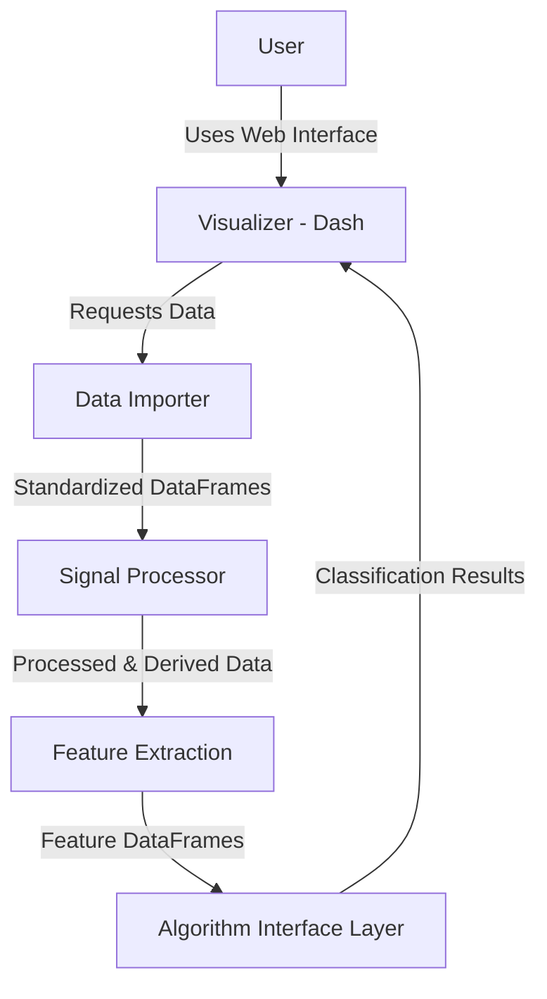
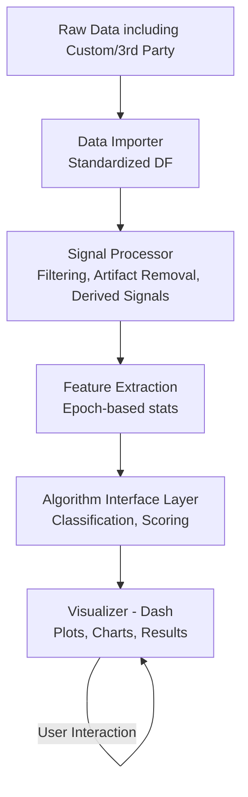

# Sleep Algorithm Explorer: Requirements & Design Specifications

This document outlines a flexible software application—**Sleep Algorithm Explorer**—designed in **Python**, using **pandas** for data handling and **Dash** for visualization. The high-level goal of this application is to import, process, visualize, and apply various sleep analysis algorithms to raw sensor data from multiple sources.

---

## Overview of Major Modules

1. **Data Importer**
    
    - **Responsibilities**:
        - Import and parse data from multiple raw data sources (both custom and third-party).
        - Normalize or convert incoming data into a standardized **pandas** DataFrame format.
        - Handle metadata (sampling rate, data source info) to facilitate consistent data handling downstream.
    - **Key Requirements**:
        - Ability to import from files (CSV, JSON, HDF5, etc.) or APIs.
        - Standardize timestamps and align with an internal data time axis.
        - Provide error handling for missing or corrupt data.
2. **Signal Processor**
    
    - **Responsibilities**:
        - Perform pre-processing on raw signals (e.g., filtering, artifact removal, resampling).
        - Generate **derived signals** (e.g., heart rate from PPG, activity counts from accelerometer).
    - **Key Requirements**:
        - Support configurable filtering methods (low-pass, high-pass, band-pass, etc.).
        - Ability to handle multi-channel data (PPG, accelerometer x/y/z, etc.).
        - Modular design to add new signal processing techniques (e.g., wavelet transforms).
3. **Feature Extraction**
    
    - **Responsibilities**:
        - Calculate features (e.g., mean, variance, heart rate variability metrics) over **epoch-based** windows.
        - Provide a flexible mechanism to define epoch sizes (default 30s, 1min, or configurable).
    - **Key Requirements**:
        - Easy integration with derived signals from the **Signal Processor**.
        - Generate a labeled DataFrame containing feature values per epoch (e.g., per 30s window).
        - Allow extension for custom feature definitions (e.g., frequency-domain metrics, machine-learning-based embeddings).
4. **Algorithm Interface Layer**
    
    - **Responsibilities**:
        - Provide a standard interface to run **multiple sleep analysis algorithms** (e.g., classification, scoring) on the same feature set.
        - Allow external or custom algorithms to be “plugged in” with minimal integration overhead.
    - **Key Requirements**:
        - Maintain compatibility with data structures produced by Feature Extraction.
        - Provide results in a standardized format that can be visualized and compared.
        - Log and store algorithm-specific parameters and outcomes.
5. **Visualizer (Dash Front End)**
    
    - **Responsibilities**:
        - Provide interactive dashboards to browse and visualize raw data, processed signals, derived signals, features, and final results (e.g., sleep stage classification).
        - Offer timeline views, summary statistics, and multi-modal overlays (e.g., overlay heart rate on top of movement data).
    - **Key Requirements**:
        - Integrate with each module’s data output (Data Importer, Signal Processor, Feature Extraction, Algorithm Interface).
        - Provide dynamic user controls (filter selection, epoch window selection, algorithm parameters).
        - Support both local and remote usage scenarios.

---

## High-Level Requirements

6. **Multi-Source Data Support**
    
    - Ability to import from at least three different raw data sources out of the box (e.g., Fitbit CSV, custom device text files, generic CSV).
7. **Flexible Data Processing Pipelines**
    
    - Users can enable or disable specific pre-processing steps (e.g., low-pass filter on/off).
8. **Configurable Epoch Sizes and Feature Sets**
    
    - By default, 30-second epochs for sleep classification, but user-defined epoch lengths must be supported.
9. **Extensible Algorithm Integration**
    
    - Provide a base class or interface for new algorithms to be implemented with minimal refactoring.
10. **Interactive Web-Based Visualization**
    
    - Built on Plotly Dash, offering real-time or near-real-time interactive charts.
11. **Performance and Scalability**
    
    - Efficient handling of large multi-night data sets with minimal latency in visualization.
12. **Logging and Error Handling**
    
    - Clear logs for data import errors, pre-processing issues, and algorithm exceptions.
    - Graceful handling of missing data segments or sensor corruption.

---

## Design Specifications

### Architecture Overview

Below is a simplified **C4 Container Diagram** showing the modules (as containers) and how they interact within the **Sleep Algorithm Explorer** system.

mermaid

CopyEdit



### Module-to-Module Interactions

13. **Data Importer → Signal Processor**
    
    - The Data Importer cleans and normalizes incoming data into a **pandas** DataFrame.
    - This DataFrame (with standardized timestamps, sensor values) is then fed to the Signal Processor.
14. **Signal Processor → Feature Extraction**
    
    - Output includes cleaned signals and any derived signals (heart rate, activity counts).
    - These signals must align with the same time axis for multi-sensor features.
15. **Feature Extraction → Algorithm Interface**
    
    - Aggregates signals into epoch-based features.
    - Produces a features DataFrame that includes columns such as `epoch_start_time`, `mean_accelerometer_x`, `heart_rate_var`, etc.
16. **Algorithm Interface → Visualizer**
    
    - Algorithms (e.g., sleep classification) produce output—sleep stages, risk scores, or summary stats—passed back to the Visualizer.
    - The Visualizer can overlay these results on the timeline.

---

### Detailed Specifications

#### 1. Data Importer

- **Inputs**: File paths, API endpoints, or data streams.
- **Outputs**:
    - Pandas DataFrame with columns: `timestamp`, `sensor_type`, `value1`, `value2`, etc.
    - Metadata structures storing sampling rate, device ID, etc.
- **Considerations**:
    - Must handle time zone conversions and unify to a single standard.
    - Validate data integrity (handle NaNs, out-of-range values).

#### 2. Signal Processor

- **Operations**:
    - **Filtering** (e.g., Butterworth filters).
    - **Resampling** to a common rate if different sensors have different sampling frequencies.
    - **Artifact Removal** (simple thresholding or advanced algorithms).
- **Outputs**:
    - Clean signals in time series format.
    - Derived signals (e.g., instantaneous heart rate from PPG peaks).

#### 3. Feature Extraction

- **Core Logic**:
    - Segment signals into epochs (default 30s, adjustable).
    - Compute descriptive stats: mean, median, variance, max/min, etc.
    - Compute specialized domain features: e.g., HRV (RMSSD, SDNN), frequency-domain features.
- **Outputs**:
    - Feature sets indexed by epoch time (`epoch_start_time`), sensor, or derivation.
    - Optionally, store intermediate results for debug or re-calculation.

#### 4. Algorithm Interface Layer

- **Purpose**:
    - Defines a consistent interface:
        - **Input**: A feature dataset + optional metadata.
        - **Output**: Algorithm-specific results (sleep stage labels, confidence scores, etc.).
    - Examples:
        - A basic heuristic algorithm classifying awake vs. asleep.
        - A neural network approach for multi-stage classification.
- **Extensibility**:
    - Polymorphic design to allow new algorithms with minimal modification.
    - Provide standard methods like `fit()`, `predict()`, etc.

#### 5. Visualizer (Dash)

- **Front End**:
    - Multi-page or multi-tab layout in Dash.
    - Graphical representation of the pipeline stages: raw data, cleaned signals, derived signals, features, classification.
- **Key UI Components**:
    - **Time-Series Graphs**: Overlay raw and cleaned signals.
    - **Epoch Viewer**: Show aggregated features over selected time ranges.
    - **Classification Overlay**: Color-coded sleep stages on top of time-series data.
    - **Controls**: Checkboxes or dropdowns to select algorithms, configure filters, etc.
- **Performance**:
    - Use efficient back-end structures, possibly caching pre-processed data.
    - Manage large datasets with pagination or lazy loading in the UI.

---

## Example Data Flow Diagram

Below is a simplified flowchart (not strictly C4) illustrating the end-to-end data flow from raw input to final classification:



17. **Raw Data** is ingested into the application.
18. **Data Importer** transforms it into a common DataFrame structure.
19. **Signal Processor** handles cleaning and derivation.
20. **Feature Extraction** computes epoch-based features.
21. **Algorithm Interface** runs one or more classification or scoring algorithms.
22. **Visualizer** displays all stages to the user and allows interactive exploration.

---

## Conclusion

The **Sleep Algorithm Explorer** is a modular, extensible system designed in Python using pandas and Dash. By separating concerns into distinct modules—Data Importer, Signal Processor, Feature Extraction, Algorithm Interface, and Visualizer—the application ensures a clear workflow:

23. **Import** → 2. **Process** → 3. **Extract Features** → 4. **Apply Algorithms** → 5. **Visualize & Explore**.

This architecture supports **flexible** and **scalable** analysis of multi-sensor sleep data, paving the way for efficient research, development, and deployment of novel sleep-tracking algorithms.


---
Below is an **updated version** of the **Sleep Algorithm Explorer: Requirements & Design Specifications**, integrating the **best practices and design patterns** from the report on **Modular Real-Time Sleep Tracking Pipelines**. Key new points and refinements focus on **real-time streaming**, **low-latency processing**, **modular pipe-and-filter architecture**, **edge vs. cloud trade-offs**, and **minimal sensor sets** for practical wearable-based sleep tracking.

---

# Sleep Algorithm Explorer: Requirements & Design Specifications (Updated)

This document describes a flexible software application—**Sleep Algorithm Explorer**—designed in **Python**, using **pandas** for data handling and **Dash** for visualization. Its goal is to **import**, **process** (in real-time or offline), **visualize**, and **apply** various sleep analysis algorithms to sensor data from multiple sources.

## Incorporating Real-Time & Modular Pipeline Best Practices

In light of the **Modular Real-Time Sleep Tracking Pipeline: Best Practices**, we have updated the system to emphasize:

1. **Pipe-and-Filter Architecture**
    
    - Each stage (import, signal processing, feature extraction, algorithm classification, visualization) is an independent “filter” receiving an input data stream and producing an output stream for the next stage.
    - This allows real-time or near-real-time data flow, **low-latency** detection of sleep state transitions, and easy swapping/adding of new filters.
2. **Producer–Consumer & Streaming**
    
    - The application may ingest data **continuously** (from live sensor feeds) or in **offline batches** (from CSV, HDF5, etc.).
    - For real-time usage, concurrency patterns (queues, async I/O) ensure that continuous sensor data ingestion does not block the signal processing pipeline.
3. **Short, Overlapping Windows for Sleep Classification**
    
    - While **30-second epochs** remain the default for traditional scoring, users can define **shorter overlapping windows** (e.g., 10 seconds) to minimize latency in detecting transitions (wake ↔ sleep, light ↔ deep, etc.).
    - Optionally integrate **online change-point detection** or thresholds to catch abrupt changes immediately.
4. **Minimal Sensor Sets**
    
    - Emphasis on accelerometer (motion) and PPG-based heart rate as a **high-value** minimal set.
    - Additional signals (e.g., skin temperature, SpO₂) can be integrated if needed, but the system remains streamlined for the most critical signals (movement + HR/HRV).
5. **Edge vs. Cloud Processing**
    
    - The design supports **on-device (edge) processing** for low-latency detection and privacy.
    - Larger or more computationally heavy algorithms can optionally run in the **cloud**, using the same module interfaces for classification and result visualization.

---

## Updated High-Level Modules

6. **Data Importer**
    
    - **Responsibilities**:
        - Ingest data from **real-time streams** (BLE, serial, websockets) or from **offline** files/APIs.
        - Normalize incoming data to a standard pandas `DataFrame` or **stream buffer** for real-time usage.
        - Handle metadata (sensor type, sampling rate, device ID, time zone) consistently.
    - **Key Updates**:
        - Real-time ingestion framework (producer–consumer pattern) to feed the pipeline without blocking.
        - Ability to unify timestamps across streams, essential for **multi-sensor synchronization** in real-time or offline.
7. **Signal Processor**
    
    - **Responsibilities**:
        - Pre-process raw signals (filtering, artifact removal, resampling).
        - Generate **derived signals** (e.g., heart rate from PPG peaks, activity index from accelerometer).
    - **Key Updates**:
        - **Causal, low-latency filters** (Butterworth, exponential smoothing) to minimize time lag.
        - **Short window** computations (e.g., 5–15 sec) feasible for continuous or near-real-time updates.
        - Support streaming data structures or chunk-based processing (small batches vs. entire time series).
8. **Feature Extraction**
    
    - **Responsibilities**:
        - Convert processed signals into features over defined windows (default 30s or user-specified).
        - Provide domain-specific features (HRV, frequency-domain metrics, etc.).
    - **Key Updates**:
        - **Overlap-friendly** epoching (e.g., a new feature vector every 10 seconds, using the last 30s of data).
        - Potential integration of **change-point detection** to trigger re-computation or flag transitions.
        - Cache or store partial computations to avoid high overhead in real-time scenarios.
9. **Algorithm Interface Layer**
    
    - **Responsibilities**:
        - A consistent interface (e.g., `fit()`, `predict()`) for **multiple sleep analysis algorithms**: heuristic, ML, or deep learning.
        - Output standardized classification/stage labels plus confidence or probability scores.
    - **Key Updates**:
        - Support for **incremental or streaming** classifiers (e.g., Hidden Markov Models, online learning approaches).
        - Real-time or near-real-time state updates, potentially every few seconds for low-latency detection.
        - Ability to run locally (edge) or offload to a **cloud-based** service, returning results via API.
10. **Visualizer (Dash Front End)**
    
    - **Responsibilities**:
        - Interactive dashboards for raw data, processed signals, derived signals, features, and final classification results.
        - Offer timeline views, overlays (e.g., motion vs. heart rate), and parameter controls for filters/algorithms.
    - **Key Updates**:
        - **Real-time streaming plots**: automatically refresh from the pipeline if live data is available.
        - Low-latency display of classification changes, highlighting transitions (sleep ↔ wake).
        - Efficient data handling (e.g., caching, chunked updates) to handle large or continuous data.

---

## High-Level Requirements (Revised)

11. **Multi-Source Data Support**
    - Import at least three different sources (Fitbit CSV, custom device text, generic CSV, or real-time BLE stream).
12. **Flexible Data Processing Pipelines**
    - Enable or disable specific pre-processing steps; adapt easily to new filters.
    - Support real-time **pipe-and-filter** design so each step can be swapped/modified independently.
13. **Configurable Epoch Sizes & Low-Latency Windows**
    - Default 30s epochs for offline scoring but allow **shorter overlapping windows** (e.g., 10s) for near-real-time detection.
14. **Extensible Algorithm Integration**
    - A base class for new algorithms with minimal refactoring.
    - Support incremental or streaming classification modes (for real-time usage).
15. **Interactive Web-Based Visualization**
    - Built on Plotly Dash with real-time or near-real-time updates.
    - Visualization layers for signals, features, and classification outputs.
16. **Performance & Scalability**
    - Handle large multi-night data sets offline or continuous real-time data with minimal latency.
    - Option to deploy on device (edge) for low-latency or cloud for heavier analytics.
17. **Logging and Error Handling**
    - Clear logs for both offline batch import **and** real-time streaming issues (e.g., sensor dropouts).
    - Graceful handling of data gaps or corruption in continuous streams.

---

## Design Specifications (Updated)

### Architecture Overview (Pipe-and-Filter Emphasis)

```mermaid
%% C4 Container Diagram with Streaming Emphasis %%
flowchart TB
    A[User] -->|Uses Web Interface| B[Visualizer - Dash]
    B -->|Requests Data (Real-Time or Batch)| C[Data Importer]
    C -->|Normalized Streams/DataFrames| D[Signal Processor]
    D -->|Cleaned & Derived Streams| E[Feature Extraction]
    E -->|Features in Short or Long Epochs| F[Algorithm Interface]
    F -->|Classification/Staging| B
```

### Real-Time Pipeline Considerations

- **Producer–Consumer**: The Data Importer may act as the producer (reading sensor data or files), placing data into a buffer. The Signal Processor and subsequent modules consume from this buffer in small batches or streams.
- **Short Overlapping Windows**: By default, 30-second epochs can overlap every 10 seconds, feeding features into the Algorithm layer more frequently for near-real-time detection.

### Module-to-Module Interactions (Revised)

18. **Data Importer → Signal Processor**
    - Real-time or batch.
    - For streaming, a queue or generator is used to pass data frames or small chunks to the next stage.
19. **Signal Processor → Feature Extraction**
    - Outputs **cleaned/derived signals** in **short intervals** to keep latency low.
    - Resampling aligned with a common time axis if multiple sensors differ in sampling rate.
20. **Feature Extraction → Algorithm Interface**
    - Produces **rolling or epoch-based** features (mean, variance, HRV metrics, etc.).
    - In streaming mode, each new chunk triggers re-computation or update of features.
21. **Algorithm Interface → Visualizer**
    - Algorithm modules can produce **continuous or epoch-based** classification results.
    - The Visualizer updates real-time plots or offline dashboards for the user.

---

### Detailed Specifications & Best Practices

#### 1. Data Importer

- **Inputs**: Real-time BLE/serial streams, file paths (CSV/JSON/HDF5), or REST APIs.
- **Outputs**: Pandas `DataFrame` or streaming buffer with columns like `timestamp`, `sensor_type`, `valueX`, etc., plus metadata.
- **New Considerations**:
    - **Buffering**: Use a queue-based or async approach if real-time streams arrive at high frequency.
    - **Time Zone**: Convert to a consistent baseline; handle clock drift for wearables.

#### 2. Signal Processor

- **Operations**:
    - **Filtering**: Causal filters with minimal phase distortion for real-time usage.
    - **Artifact Removal**: Threshold-based or advanced approaches on small chunks.
    - **Resampling**: Standardize frequencies, crucial for multi-sensor synchronization.
- **Outputs**: Clean signals + derived metrics (e.g., instantaneous heart rate from PPG).
- **New Considerations**:
    - **Low-Latency**: Keep filter windows short. Possibly use exponential smoothing or small median kernels to reduce lag.
    - **Streaming**: If data arrives in bursts, handle partial batches without waiting for large blocks.

#### 3. Feature Extraction

- **Core Logic**:
    - Segment data into **configurable epochs** (30s standard, but can use 10s or shorter for real-time).
    - Compute stats: mean, variance, HRV (RMSSD, SDNN), frequency-domain metrics, etc.
- **Outputs**: Feature sets indexed by time windows.
- **New Considerations**:
    - **Overlapping Windows**: e.g., a new feature vector every 5–10 seconds to catch transitions.
    - **Change-Point Detection**: Optionally detect abrupt changes to expedite re-classification.

#### 4. Algorithm Interface Layer

- **Purpose**:
    - A unified API to pass in features (optionally streaming) and get back classification/staging results.
    - Support multiple methods: rule-based, machine learning, deep neural networks.
- **New Considerations**:
    - **Incremental Models**: E.g., an HMM or an RNN that updates state with each new chunk.
    - **Edge vs. Cloud**: If running locally, ensure the model is optimized for real-time inference; if remote, handle network latency carefully.

#### 5. Visualizer (Dash)

- **Front End**:
    - Multi-tab or multi-page Dash app, showing raw signals, processed signals, features, and final classifications.
- **New Considerations**:
    - **Real-Time Charts**: Refresh automatically with minimal overhead. Possibly show a rolling window of the last few minutes plus classification overlay.
    - **Latency Handling**: Keep frame updates frequent but lightweight to avoid UI slowdowns.
    - **Transition Highlighting**: Indicate detected changes in sleep state, possibly with color changes or pop-up alerts.

---

## Example Real-Time Data Flow Diagram

```mermaid
flowchart TD
    A[Real-Time Sensor Data <br>(Accelerometer, PPG)] --> B[Data Importer <br>(Producer: streaming queue)]
    B --> C[Signal Processor <br>(Filtering, HR derivation)]
    C --> D[Feature Extraction <br>(Overlapping windows)]
    D --> E[Algorithm Interface Layer <br>(Incremental classification)]
    E --> F[Visualizer - Dash <br> (Real-Time Plots & Alerts)]
    F -->|User Interaction| F
```

22. **Sensors** stream raw data at a given rate (accelerometer, PPG).
23. **Data Importer** (producer) enqueues data in small chunks.
24. **Signal Processor** (consumer) filters and derives signals with minimal latency.
25. **Feature Extraction** runs on short overlapping windows, updating features frequently.
26. **Algorithm Interface** calculates or updates sleep/wake/stage classification in real time.
27. **Visualizer** displays live graphs, classification overlays, and potential transitions.

---

## Conclusion

The **Sleep Algorithm Explorer** now supports:

28. **Modular Pipe-and-Filter Architecture** – Each stage is an independent module, enabling flexible real-time or offline analysis.
29. **Low-Latency Real-Time Pipeline** – Short, overlapping windows and concurrency patterns allow near-immediate detection of sleep state changes.
30. **Minimal Sensor Focus** – Emphasis on accelerometer + heart rate as a high-value core, with additional sensors optional.
31. **Edge vs. Cloud Flexibility** – Run locally on resource-constrained devices or offload heavier computations to the cloud; both share the same modular interface layer.
32. **Interactive Visualization** – Plotly Dash dashboards deliver real-time feedback, timeline overlays, and user controls to adjust filters, epochs, and algorithms on the fly.

This enhanced design ensures the **Sleep Algorithm Explorer** is both **scalable** (handling multi-night data sets) and **responsive** (real-time streaming for immediate insights). The **pipe-and-filter** structure, combined with short-window feature extraction and incremental classification, enables robust, low-latency detection of sleep states while still accommodating traditional offline epoch-based workflows.