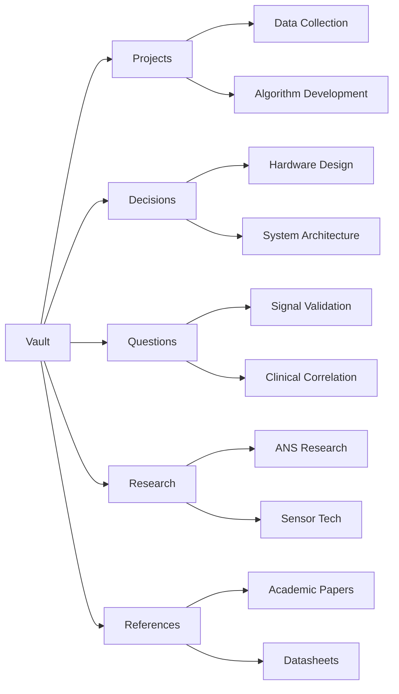

# Sleep Monitoring Wearable Development Initiative

## Project Overview
This repository documents the development of a next-generation wearable device capable of real-time sleep state tracking. The system combines multi-modal biosignal acquisition with machine learning algorithms to achieve clinical-grade sleep staging accuracy in a consumer-friendly form factor.

**Key Features:**
- Multi-sensor integration (PPG, accelerometry, temperature, bioimpedance)
- Real-time sleep stage classification (Wake/N1/N2/N3/REM)
- Wireless data collection and cloud synchronization
- Adaptive closed-loop interventions (soundscapes, light modulation, optimized wake timing)

**Development Goals:**
1. Prototype multi-location sensor hardware
2. Develop optimized sleep staging algorithms
3. Create scalable data collection infrastructure
5. Achieve <30s detection latency

## Repository Organization

### Obsidian Vault Structure

### Key Canvases
Canvases contain the mapping between notes for different levels and areas of the product development initiative.
- [[ProductDecisionMap.canvas|ProductDecisionMap]] - contains the overview of the product decisions and there inter-dependencies with each other as well as key questions and project outcomes
- [[ProjectMap.canvas|ProjectMap]] - contains the overview map for the various development projects and their inter-dependencies with each other and direct decisions and questions
- Project Roadmaps - contain the tasks for each individual development project
	- [[Roadmap-R01-DataCollection.canvas|Roadmap-R01-DataCollection]]

### Key Directories
| Directory     | Purpose                        | Example Files                   |     |
| ------------- | ------------------------------ | ------------------------------- | --- |
| `Projects/`   | Active development initiatives | [[Project-P01-DataCollection]]  |     |
| `Decisions/`  | Design choices and rationale   | [[Decision-D12-Sensors]]        |     |
| `Questions/`  | Research inquiries             | [[Question-Q07-OptimalSignals]] |     |
| `Research/`   | Technical deep dives           | [[Research-SleepStaging]]       |     |
| `References/` | Supporting materials           | [[sensors-20-04009]]            |     |

### Workflow Tools
1. **Canvas Maps**: [[ProjectMap]] shows initiative relationships
2. **Atomic Notes**: Questions, Decisions, Tasks, and Projects as discrete units
3. **Bi-directional Linking**: Notes connect via shared concepts and dependencies

